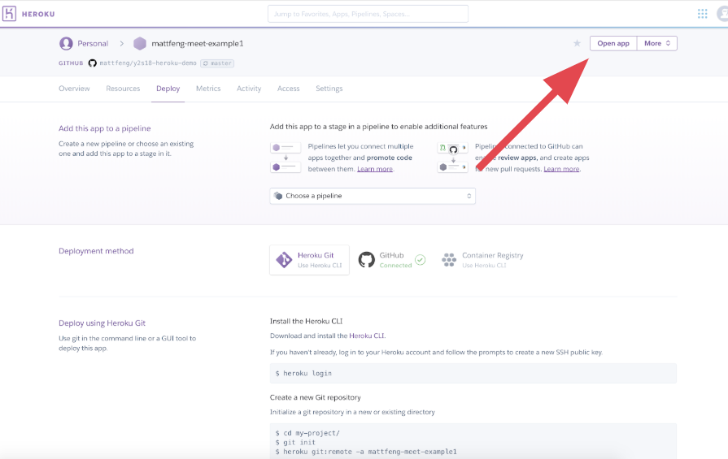

# y2s19-heroku-demo

## 0. Setup
To deploy on Heroku, you need two additional files in your folder. A `requirements.txt` that lists all the python libraries Heroku will need and a `Procfile` which contains the code that runs your `app.py`.
  To see what python libraries you have on your computer, go to a terminal and run `pip freeze`. To put these libraries in a files, you can run `pip freeze >> requirements.txt`. However, you also need to make sure to have `gunicorn` library in the requirements as well.
  The `Procfile` will stay mostly stay the same for any project as long as you consistently name your server file `app.py`.
## 1. Create/sign-in to your heroku account and click `new` and `Create new app`
 
## 2. Give your project a unique name and click `Create app`
## 3. Under Deployment method (how heroku will find your project's code), click `GitHub`
 
## 4. Search for the right repository `y2s19-heroku-demo` and click `Connect`
 
## 5. Click on `Enable Automatic Deploys` so that whenever you update your repo, it will update the heroku site. Then click `Deploy Branch` to deploy it the first time.
 
## 6. Wait until it finishes Deploying and then open the app!
 
